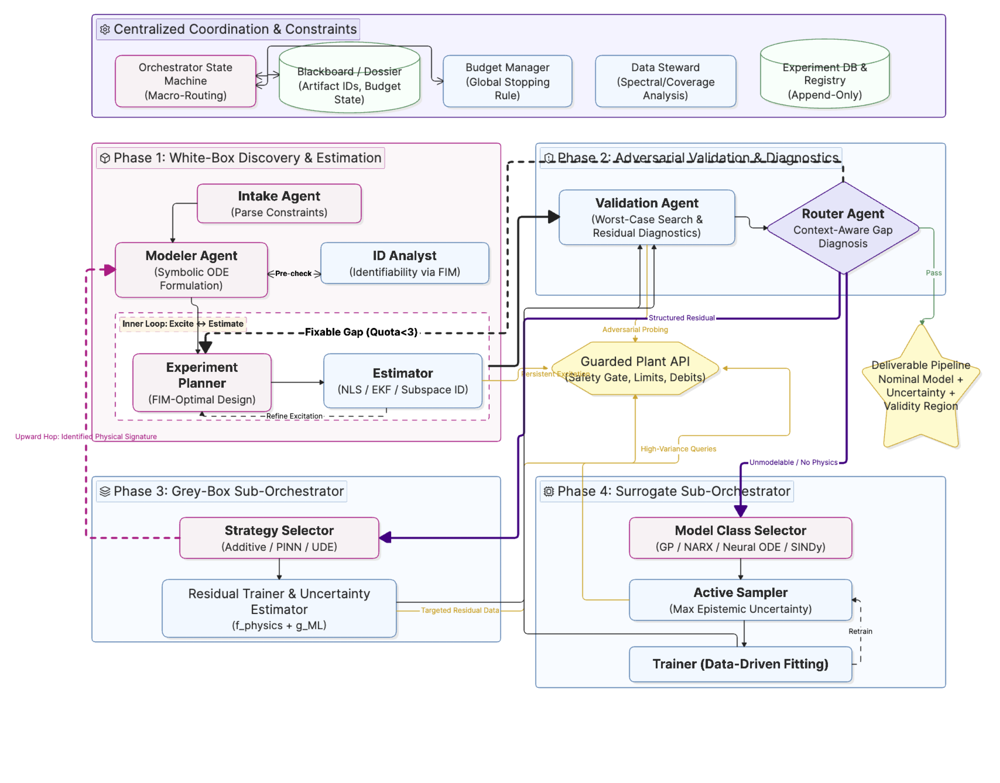

# Agentic SysID

An autonomous multi-agent pipeline for **system identification** of real physical plants. Given a plant that can be excited with inputs and observed at its outputs, the system produces a **control-ready model** — model + uncertainty description + validity region — with minimal human involvement, under the hard constraint that real experiments are expensive.

<p align="center">
  
</p>

*Side-by-side: actual plant (blue) vs. identified model (orange) under composite PRBS excitation. Parameter accuracy shown bottom-left.*

---

## What it does

The pipeline automates the full identification workflow that a control engineer performs by hand:

1. **Parse the plant description** — the Intake agent reads a natural-language description and creates a `PlantContract` (signal names, limits, sample rate).
2. **Derive the physics model** — the Modeler agent constructs the symbolic ODE structure and checks structural identifiability.
3. **Estimate parameters** — the Estimator agent runs an inner excite↔estimate loop: design informative inputs → apply to plant → fit parameters via NLS → assess covariance → repeat.
4. **Validate adversarially** — the Validation agent probes the model against the plant with challenging scenarios and classifies any failure mode.
5. **Escalate on failure** — if the white-box model fails, the pipeline descends the fidelity ladder automatically:
   - `structured_residual` (e.g. unmodelled friction) → **grey-box sub-orchestrator** (physics backbone + learned correction)
   - `unmodelable` / no physics → **surrogate sub-orchestrator** (GP, NARX, Neural ODE, SINDy, …)
6. **Ship** — the best validated model, its uncertainty, and its validity region are stored for downstream control synthesis.

All experiment calls are routed through a guarded **Plant API** that enforces safety limits, debits a shared budget, and logs every run to a persistent experiment database.

---

## Architecture



**Key design decisions:**

- **Fidelity ladder, physics-first.** White-box → grey-box → black-box. Descend only on evidence.
- **Experiments are a shared, budgeted resource.** Everything goes through the Plant API; no agent can bypass the safety gate or budget manager.
- **References, not contents.** Agents pass artifact IDs; raw datasets and models live in stores.
- **Lean coordination.** The orchestrator routes on three enum fields (`gap_type`, `improvable`, `budget.remaining`). It never computes them.

---

## Quick start

### Prerequisites

```bash
pip install -r requirements.txt
export ANTHROPIC_API_KEY="sk-ant-..."
```

### Run the built-in demo (pendulum plant)

```bash
python main.py
```

After the pipeline finishes, a demo animation is automatically saved to `demo/demo.gif` — showing the actual plant vs. the identified model swinging under composite excitation (step → low-freq sine → PRBS), along with a parameter accuracy comparison panel.

```bash
# Skip the demo
python main.py --no-demo

# Save as MP4 instead (requires conda-forge ffmpeg)
python main.py --demo-output demo/demo.mp4

# Run the demo standalone on any already-identified model
python visualization/demo.py                        # best validated model
python visualization/demo.py --model-id abc123      # specific model
python visualization/demo.py --output demo/demo.gif
python visualization/demo.py --segments step:3,sine:3,prbs:4
```

### Custom plant description

```bash
python main.py --desc "Small DC motor. Command voltage (±12 V), measure shaft speed (rad/s). \
  Standard electromechanical model, parameters unknown. Control-ready model needed."
```

### All CLI options

```
python main.py [OPTIONS]

  --config PATH        YAML config file (default: configs/pendulum_config.yaml)
  --desc TEXT          Plant description (overrides default)
  --seed INT           Random seed for plant simulator
  --budget FLOAT       Total experiment budget (units)
  --data-dir PATH      Root for experiment DB and model registry (default: data/)
  --model MODEL_ID     Anthropic model for LLM agents (default: claude-sonnet-4-6)
  --log-level LEVEL    DEBUG | INFO | WARNING | ERROR
  --no-demo            Skip demo animation generation after the pipeline
  --demo-output PATH   Path for demo file (default: demo/demo.gif)
```

---

## Plugging in your own plant

The pipeline is plant-agnostic. Any dynamical system — simulated ODE, hardware-in-the-loop, or external simulator — can be used without touching `main.py`. You only need to do two things: implement a plant class and write a config file.

---

### Step 1 — Copy the template plant

```bash
cp plants/my_plant_template.py plants/my_system.py
```

Open `plants/my_system.py` and fill in three things:

**a) Your true parameters** in `__init__()` — these are hidden from the pipeline:

```python
def __init__(self, noise_std: float = 0.01, seed: int = 42):
    self._rng = np.random.default_rng(seed)
    self._noise_std = noise_std
    # Your real (hidden) parameters:
    self._R  = 1.0     # Ω  armature resistance
    self._L  = 0.005   # H  armature inductance
    self._Kb = 0.05    # V·s/rad
    self._Kt = 0.05    # N·m/A
    self._J  = 0.001   # kg·m²
    self._b  = 0.001   # N·m·s
```

**b) Your true ODE** in `_ode()` — also hidden, called internally by `apply_input()`:

```python
def _ode(self, t, x, u_func):
    i, omega = x
    V = float(u_func(t)[0])
    di_dt     = (V - self._R * i - self._Kb * omega) / self._L
    domega_dt = (self._Kt * i - self._b * omega) / self._J
    return [di_dt, domega_dt]
```

**c) The metadata properties** — just sizes, no dynamics:

```python
@property
def n_inputs(self) -> int:  return 1   # one voltage input
@property
def n_outputs(self) -> int: return 1   # shaft speed measured
@property
def n_states(self) -> int:  return 2   # [current, speed]
@property
def default_x0(self) -> np.ndarray: return np.zeros(2)
```

`apply_input()` is already wired to integrate your ODE and add noise — you usually only need to adjust which state row becomes the output (`y_clean = sol.y[1:2, :]`).

> **Real hardware instead of a simulation?**
> Delete `_ode()` and replace the `solve_ivp` block in `apply_input()` with your hardware read/write calls. The interface is the same — return `(t, u, y)`.

---

### Step 2 — Copy the template config

```bash
cp configs/my_plant_template.yaml configs/my_system.yaml
```

Edit `configs/my_system.yaml`. The most important fields:

```yaml
# Point to your plant class (module.ClassName)
plant:
  class: "plants.my_system.MySystem"
  noise_std: 0.01        # passed to __init__() as a kwarg

# Signal names and safe limits — visible to the agents
contract:
  name: "dc_motor"
  input_names:  ["voltage"]
  output_names: ["shaft_speed"]
  state_names:  ["current", "omega"]
  input_limits:
    voltage: [-12.0, 12.0]
  sample_time: 0.001

  # MOST IMPORTANT: what the Modeler LLM reads to derive the ODE
  description: >
    DC motor driven by armature voltage (±12 V). Output: shaft speed (rad/s).
    Standard electromechanical structure (armature circuit + rotor inertia)
    but all parameters are unknown. Control-ready model needed.

experiment:
  total_budget: 200.0
```

**What to write in `description`:** think of it as the briefing you would give a control engineer on their first day. Mention the physical domain, what the input and output are (with units), what physics structure you believe is correct, and what is uncertain. The richer the description, the better the Modeler's ODE will be.

---

### Step 3 — Run

```bash
export ANTHROPIC_API_KEY="sk-ant-..."
python main.py --config configs/my_system.yaml
```

That's it. The pipeline will:
1. **Intake** — parse your description, create a `PlantContract`
2. **Modeler** — derive the symbolic ODE from physics
3. **Estimator** — design experiments, excite your plant, fit parameters
4. **Validation** — probe the fitted model adversarially
5. **Grey-box / Surrogate** — escalate automatically if white-box fails
6. **Ship** — store the best model in `data/models/`

Optional CLI overrides:

```bash
python main.py \
  --config configs/my_system.yaml \
  --budget 300 \
  --seed 7 \
  --log-level DEBUG \
  --data-dir results/my_system_run1
```

---

### What `apply_input()` must return

| Variable | Shape | Description |
|---|---|---|
| `t` | `(N,)` | Time vector in seconds |
| `u` | `(n_inputs, N)` | Input applied at each sample |
| `y` | `(n_outputs, N)` | **Noisy** measured outputs |

`y` must always be 2-D, even for a single output. Use `sol.y[k:k+1, :]` not `sol.y[k, :]`.

---

### Common patterns

**Single-output, hidden state (most common — like the pendulum):**
```python
# Only angle is measured; angular velocity is a hidden state
y_clean = sol.y[0:1, :]   # state index 0 = angle
```

**Direct state measurement (e.g. tank level, directly observed):**
```python
# Level h is both a state and the only output
y_clean = sol.y[0:1, :]   # state index 0 = h
```

**Speed measured but not position (e.g. DC motor, tachometer output):**
```python
# State 0 = position (hidden), state 1 = speed (measured)
y_clean = sol.y[1:2, :]   # state index 1 = omega
# Set output_state_index: 1 in your Modeler config / store_model call
```

---

## The deliverable

Every run produces:

| Artifact | Description |
|---|---|
| **Model** | White-box (ODE + fitted params), grey-box (physics + ML correction), or surrogate |
| **Uncertainty** | Parameter covariance, ensemble spread, or GP predictive variance |
| **Validity region** | Operating envelope where the model was certified, to the achieved RMSE |
| **Provenance** | All experiment run IDs, total budget spent, validation scores |

Stored in the model registry under `data/models/` and traceable to raw data in `data/runs/`.

---

## Demo plant: pendulum with friction

The default demo uses a simulated pendulum (torque in, angle out) with:
- Unknown moment of inertia, mass, rod length
- Viscous friction (unknown coefficient)
- Coulomb/dry friction (unknown magnitude) — the pathological case that breaks the white-box linear model and forces escalation to grey-box

This is a deliberately hard test case: the white-box model is structurally correct but incomplete, producing non-white residuals correlated with `sign(angular velocity)`. The grey-box agent learns the friction correction; if that also fails, the surrogate takes over.

---

## Current scope and limitations

### White-box / grey-box path: scalar ODEs in companion form

The white-box and grey-box simulator (`make_ode_simulator`) supports scalar ODEs
of **any order n** written in companion form — the Modeler specifies the normalized
highest-derivative expression and lists all state variables in ascending derivative order:

| System | `state_vars` | `normalized_rhs` example |
|---|---|---|
| Tank level (1st-order) | `["h"]` | `"(q_in - k*sqrt(h)) / A"` |
| Pendulum / motor (2nd-order) | `["theta", "theta_dot"]` | `"K_in*tau - tau_d*theta_dot - K_g*sin(theta)"` |
| Flexible beam (3rd-order) | `["q", "q_dot", "q_ddot"]` | `"(F - b*q_ddot - k*q_dot - c*q) / m"` |

**What this covers:** any single-input, single-output n-th order scalar ODE where
the output is one of the state variables (selectable via `output_state_index`).

**What this does not yet cover:**

- **MIMO systems** — multiple inputs or multiple outputs require extending the
  `PlantContract`, the `make_ode_simulator` lambdify step, and the OLS/multi-shoot
  state estimation.
- **Coupled first-order systems** — e.g. two interacting tanks `[h1_dot, h2_dot] = f(h1, h2, q)`,
  where the ODE cannot be written as a single companion chain. Each equation is
  currently stored as a single `normalized_rhs` string, not a list.
- **Discrete-time state-space models** — not supported in the white-box path
  (the surrogate path is model-class agnostic).

**State estimation note:** hidden states are estimated by numerically differentiating
the measured output (Savitzky-Golay smoothed). Each derivative is noisier than the
last, so for order ≥ 3 the OLS warm-start quality degrades. This is acceptable for
producing an initial guess; the NLS fitting step then refines against the actual data.

---

### Other current limitations

- **One demo plant** — only `PendulumPlant` ships out of the box; plugging in any `BasePlant` subclass is straightforward (see *Adding a new plant* above).
- **LLM agents require an Anthropic API key** — Intake and Modeler call Claude; all other agents are deterministic.

---

## Future directions — full generality (MIMO and coupled systems)

The current companion-form approach is the right short path. The full generalization
requires two deeper changes, both well-defined in the literature:

### 1. First-order ODE system representation

Instead of storing one `normalized_rhs` string, the Modeler would store a **list**
of n RHS expressions — one per state equation:

```python
"rhs_list": [
    "x1",                              # dx0/dt = x1
    "x2",                              # dx1/dt = x2
    "(-b*x2 - k*x1 - c*x0 + F) / m"   # dx2/dt = f(...)
]
```

`make_ode_simulator` would lambdify each expression and return the full vector
`[f0(x,u), f1(x,u), ..., fn-1(x,u)]`. This removes the companion-form restriction
and supports any coupled first-order system (multiple tanks, reaction networks,
multi-body kinematics with constraints, etc.).

**Complexity:** moderate — the companion form is a special case of this.

### 2. State observer for multi-shooting initialization

Currently, hidden states at each multi-shooting segment boundary are estimated by
numerically differentiating the output. This is cheap and accurate enough for
second-order systems but breaks down for:
- Systems where the output is not directly a state (e.g. a nonlinear observation function)
- High-order systems (4th+ derivative of a noisy signal is unusable)
- Coupled MIMO systems where individual state trajectories are not separable

The rigorous solution is an **Extended or Unscented Kalman Filter pre-pass**: before
fitting parameters, run an EKF/UKF over the identification data with a nominal (prior)
parameter set to reconstruct a full-state trajectory. Those estimates initialize the
segment boundaries. The EKF gain adapts to measurement noise automatically.

Alternatively, the classical **multiple-shooting optimization** formulation treats
the hidden initial states of each segment as additional optimization variables
alongside the physical parameters. The optimizer jointly fits parameters and
segment initial conditions, with continuity constraints across boundaries.
This avoids needing an observer but increases the problem size proportionally
to the number of segments times the state dimension.

**Complexity:** high — the EKF pre-pass or augmented optimization are non-trivial,
and each requires careful tuning of noise covariances or regularization.
